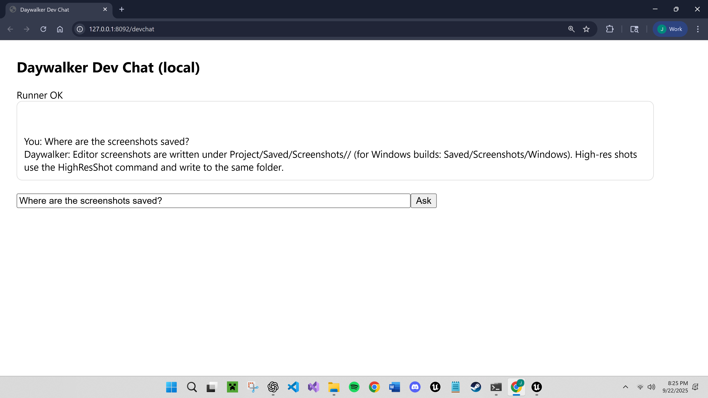
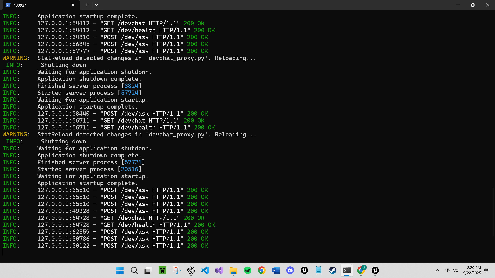
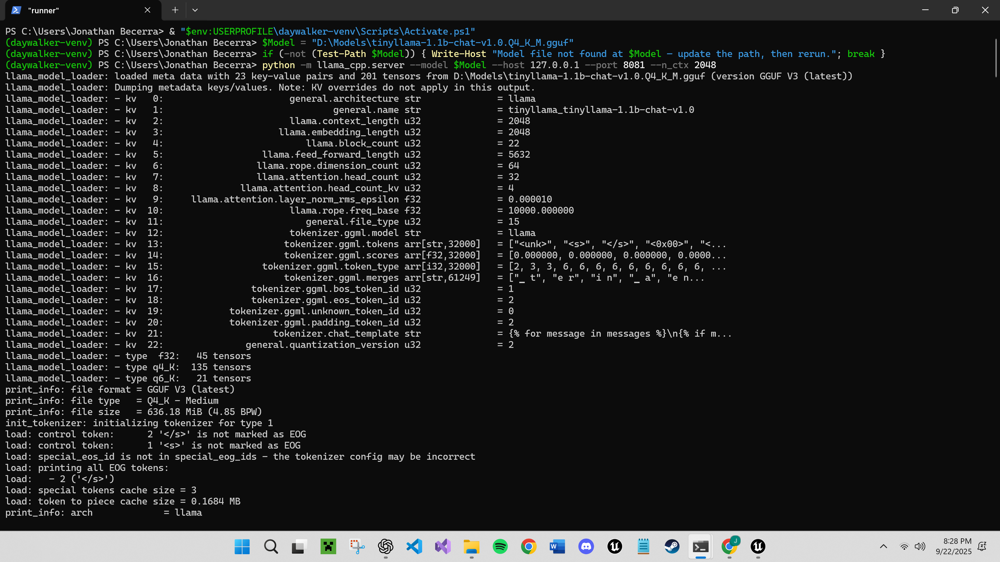
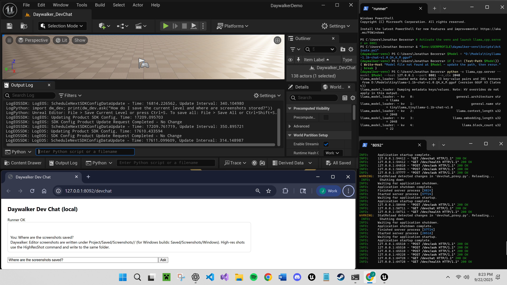

# Daywalker v0.1

Website: https://ConstructASI.com
Release: https://github.com/jerome-madstages/Daywalker/releases/tag/v0.1

This prototype demonstrates a local runner + proxy calling a compact chat model, with UE5 in-editor demo (screens + short clip).

Docs:
- Daywalker_v0.1/Docs/GLOSSARY.md
- Daywalker_v0.1/Docs/QUICKSTART.md
- Daywalker_v0.1/Docs/DEMO_RECIPE.md
- Daywalker_v0.1/Docs/UE_DASHBOARD.md

## Dev Chat (Pops-lite)

Local Unreal-first developer chat that runs offline. The UE Python helper talks to a small proxy on localhost:8092, which relays to a local llama.cpp server on localhost:8081. No cloud dependency.

Quickstart
- Start runner (example):
  python -m llama_cpp.server --model D:\Models\mistral-7b-instruct-q4_K_M.gguf --host 127.0.0.1 --port 8081 --n_ctx 4096
- Start proxy:
  DevChat\start_devchat_proxy.ps1   (or: python -m uvicorn devchat_proxy:app --host 127.0.0.1 --port 8092 --reload)
- In UE Editor Python console:
  import dw_dev; print(dw_dev.ask("How do I save the current level?"))

Files
- DevChat\devchat_proxy.py
- Docs\DevChat.md
- Samples\UE\Python\dw_dev.py

What works today
- Runner on 8081, proxy on 8092, UE helper round-trip
- Small UE knowledge base answers for common tasks
- Strict Unreal/Daywalker scope in system prompt

In progress
- In-editor UI widget
- Expanded memory and multiple personas
- Code awareness and Pops-lite conversational interface

Notes
- Unreal-first; Unity adaptation planned
- See Docs\DevChat.md for details

## Media

